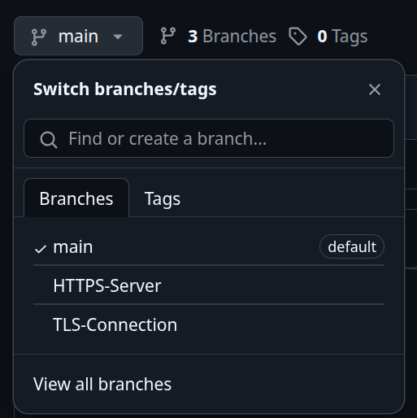

# 🔐 TLS y HTTPS – Portal Principal

Bienvenido al repositorio del proyecto **TLS y HTTPS**, elaborado como parte de la Tarea Extraclase #3 del curso **Algoritmos y Estructuras de Datos II (CE2103)**, del Instituto Tecnológico de Costa Rica.

Este repositorio contiene dos programas sencillos que ilustran la **implementación práctica de seguridad en redes** mediante los protocolos **TLS (Transport Layer Security)** y **HTTPS (Hypertext Transfer Protocol Secure)**.

---

## 📌 Objetivo del Proyecto

Este proyecto tiene como propósito:

- ✅ **Explicar** los protocolos TLS y HTTPS y su importancia en la seguridad de sistemas.
- ✅ **Aplicar** TLS en un programa que permite conectarse a google por medio de handshakes.
- ✅ **Aplicar** HTTPS en una aplicación cliente-servidor que permite cargar, consultar y descargar archivos almacenados.

---

## 📁 Estructura del Repositorio

El branch principal (`main`) **no contiene directamente el código fuente** de los programas, sino que sirve como **portal central**. Desde aquí puedes acceder fácilmente a cada una de las ramas (`branches`) donde se encuentran las implementaciones.

| Programa                     | Rama (`branch`)           | Descripción                                                                 |
|-----------------------------|---------------------------|-----------------------------------------------------------------------------|
| 🔐 TLS – Cliente/Servidor   | [`TLS-Connection`](https://github.com/AnthonyArtavia20/HTTPS-TLS_Programs/tree/tls-implementation) | Comunicación segura usando TLS con sockets en C++. |
| 🌐 HTTPS – Cliente Web      | [`HTTPS-Server`](https://github.com/AnthonyArtavia20/HTTPS-TLS_Programs/tree/https-implementation) | Uso de HTTPS para consumir APIs de forma segura.      |

---

## 🧭 ¿Cómo navegar este repositorio?

Para visualizar el código de cada programa:

1. Haz clic sobre la rama deseada usando el selector de branches en GitHub, o desde los enlaces de la tabla anterior.
2. Una vez seleccionada, puedes clonar o descargar la rama con el botón verde `Code`.

Puedes visualizarlo también en la siguiente imagen explicativa:

  

---

## 🧾 Instrucciones de ejecución

Cada rama contiene su propio archivo `README.md` con las instrucciones específicas para compilar, ejecutar y probar el respectivo programa.

---

## 📄 Créditos

Desarrollado por:

Jiacheng Tan He
Alexs Feng Wu
Anthony Artavia

Curso: CE2103 – Algoritmos y Estructuras de Datos II  
Instituto Tecnológico de Costa Rica, 2025.

---

## 📎 Licencia

Este repositorio es solo para fines educativos y no debe ser reutilizado con fines comerciales.

